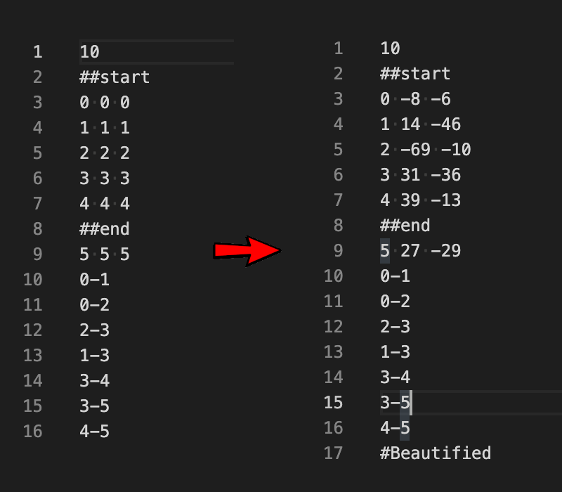

# Beautymapper

If you are doing the Lem-in project and planning to create a visualizer, you may need this tool to update the coordinates of maps created by the official generator. 
This Beautymapper transforms the coordinates in the map given, based on the relationship between rooms.

## Usage
If you are using Mac you can use the executable provided (beautymapper_mac)

```./beautymapper_mac map_from_generator```
(replace 'map_from_generator' with an actual map you want to update)

If you cannot use the provided executable you can compile it yourself:
- Install Rust
- Run ```cargo run --release map_from_generator``` from the root of the repository

Original map won't be changed and instead a new file with extension "original-name-beautified-number-of-iterations" will be created.

Example of changing a map (left is before and coordinates are random, right is after using the tool, coordinates are changed based on links between rooms):



## Advanced
Beautymapper tool is written in Rust and uses [fdg-sim](https://crates.io/crates/fdg-sim) library for graph relaxation. First it creates a graph from map input and then runs simulation algorithm for some number of iterations. By default this number is 150 but you can define it in the second argument (```./beautymapper_mac map_from_generator 200```). Bigger number of iterations increase execution time.

Examples of running the same map with different number of iterations (using the visualizer from our [Lem-in project](https://github.com/ladymarengo/Lem-in)):

50 iterations:


100 iterations:


1000 iterations:


